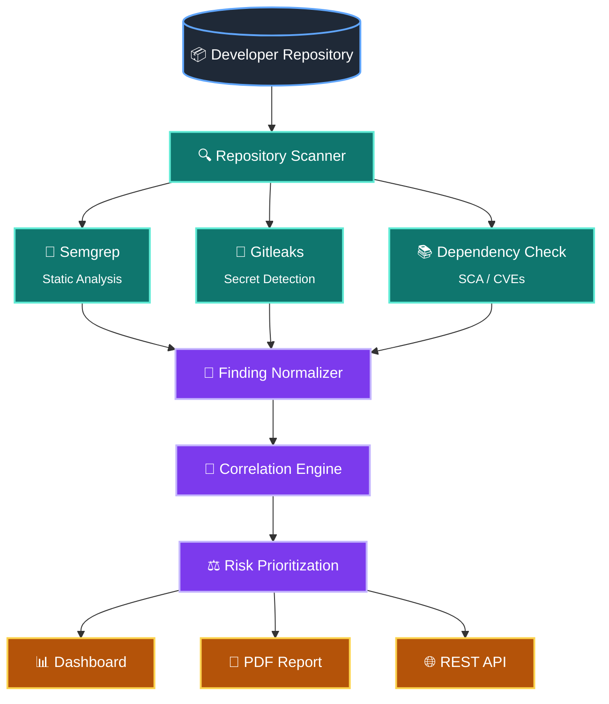

# Automated-Application-Security-Pipeline

During development, having only a dev team that manages everything from conception to deployment (or no security team/individual), they can easily miss security vulnerabilities such as exposed credentials  or an outdated dependency, and it can go undetected until an adversary finds out about it and exploit it. 

There are open source tools available for static vulnerability analysis like Semgrep, Gitleak , npm audit and more but you would have to run them individually and manually,so i thought about it and decided to create an automated system to check immediately a repository (or branch) for vulnerabilities and report them by producing a report or link it to a dashboard and trigger an alert (if we were using ELK stash).


## Architecture
 

## Tech Stack
 
- **SAST:** [Semgrep](https://semgrep.dev/)
- **Secret Scanning:** [Gitleaks](https://github.com/gitleaks/gitleaks)
- **SCA:** [OWASP Dependency-Check](https://owasp.org/www-project-dependency-check/)

# Getting Started

## 1. Clone the repository

```bash
git clone <repository-url>
cd <repository-name>
```

## 2. Install the required tools

Run the installation script:

```bash
./installtools.sh
```

## 3. Run the scanner

### Scan a GitHub repository

```bash
python main.py https://github.com/<org>/<repository>
```

### Scan a specific branch

```bash
python main.py https://github.com/<org>/<repository> --branch main
```

### Scan a local repository

```bash
python main.py /path/to/local/repository --local
```

## Examples

```bash
# Scan the default branch
python main.py https://github.com/openai/openai-python

# Scan a specific branch
python main.py https://github.com/openai/openai-python --branch dev

# Scan a local repository
python main.py ~/Projects/my-app --local
```
   
